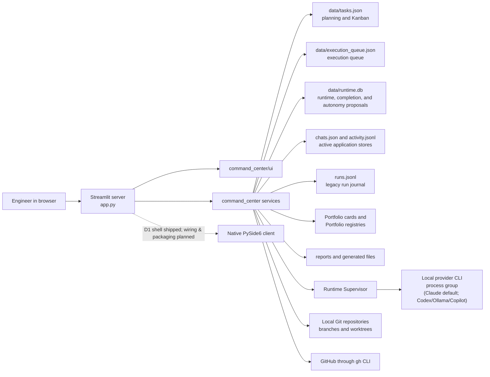

# AI Command Center — Architecture

This document describes the architecture implemented on `main`. Current code, tests, accepted
ADRs, and runtime operator documentation are authoritative if another document conflicts with this
description.

The current product is a Streamlit application. The native PySide6 design under
[`docs/desktop/`](docs/desktop/README.md) has begun landing: Desktop Increment 1 — the
`command_center.desktop` shell (navigation, theming, settings/geometry persistence) — is
implemented and pytest-qt tested, while the data-adapter, platform-abstraction, and native
packaging/installer increments are not yet built.

## 1. System context

AI Command Center is a local engineering control plane. A browser connects to a Streamlit server
running `app.py`; that Python process reads local planning and Portfolio files, persists execution
state in SQLite, starts local Claude CLI subprocesses, inspects and mutates explicitly selected Git
worktrees through bounded services, and can use the local `gh` CLI for completion workflows.

It is not a distributed scheduler or a durable remote-worker platform.



Streamlit itself serves HTTP and WebSocket traffic. **The application has no authentication layer**
yet performs privileged git/gh and subprocess operations, so every launch path is constrained to
keep it off-host unless the operator deliberately opts out:

| Launch path | Control |
|---|---|
| `streamlit run app.py` | `.streamlit/config.toml` pins `[server] address = "localhost"` |
| `scripts/start-ui.sh` | injects `--server.address localhost` unless one is passed |
| container entrypoint | `scripts/aml-entrypoint.sh` has **no default** and exits `78` unless `STREAMLIT_SERVER_ADDRESS` is set |
| `docker compose` | the port is published on `${AML_BIND_HOST:-127.0.0.1}` |

`tests/test_deployment_exposure.py` is the gate for all four. Not being exposed is not the same as
being authenticated: HTTP authentication is a separate, still-open piece of work, so widening any of
these controls means putting an unauthenticated privileged console on the network.

## 2. UI and service boundaries

### 2.1 Streamlit host

`app.py` is a direct Streamlit script and is re-executed top to bottom on interactions. It:

- configures the page and sidebar;
- applies staged cross-page navigation;
- loads planning tasks;
- caches one `ExecutionCenterAPI` and process-local Supervisor per Streamlit server process;
- performs startup runtime reconciliation once for that cached resource;
- renders top-level pages through a flat `if/elif` route;
- uses timed Streamlit fragments to poll execution and completion views.

`NAV` registers 20 page handlers: Dashboard, Workspace Home, Executive, Create Task,
Project Chat, Kanban, Волны (Waves), AI Agents, Live Execution Center, Run Journal, Timeline,
Projects, Generated Files, Reports, Context, Git Center, Workspace Launcher, Focus Mode, Portfolio
Execution, and Portfolio Overview. The sidebar (`command_center/ui/sidebar.py`) renders 16 of
them; Project Chat, Generated Files, Reports, and Context are held back by `HIDDEN_FROM_SIDEBAR`
and open inside the project view, though the `if/elif` route and deep links still reach every
handler.

`app.py` remains a large presentation and orchestration surface. `command_center/ui/` contains
selected extracted panels and components, including the execution queue, recommendations, project
selection and intelligence, Portfolio execution and overview, and shared shell elements. The
primary Live Execution Center, completion-status, and Workspace Home renderers remain in `app.py`.
`command_center/ui/` may import Streamlit; domain, storage, and runtime services remain plain
Python.

### 2.2 Application and domain services

Important service groups are:

- `models.py`, `tasks_repository.py`, and `storage.py`: planning model normalization, locked task
  mutations, atomic JSON, and JSONL primitives;
- `project_config.py`: project registry, repository paths, sensitivity, and completion policies;
- `launch.py` and `launch_service.py`: workspace selection, read-only preflight, confirmation
  state, provisionable/blocked classification, and legacy/current launch bridges;
- `workspace_provisioning.py`: offline worktree provisioning and fail-closed source-repository,
  branch, isolation, and status verification for normal task-v2 launch paths;
- `execution_queue.py`: persisted queue entries, readiness, and same-host locked mutation helpers;
- `portfolio_models.py`, `portfolio_config.py`, `portfolio_launch.py`, and
  `portfolio_intelligence.py`: Portfolio parsing, repository mapping, execution planning,
  worktree orchestration, registry coordination, and read-only intelligence;
- `worktree_launcher.py`: validated branch/worktree creation and attachment;
- `runtime/api.py`: UI-facing execution facade;
- `runtime/db.py`: SQLite schema, transactions, state guards, compare-and-swap updates, and
  workspace locks;
- `runtime/supervisor.py`: live subprocess ownership and lifecycle;
- `runtime/scheduler.py`: deterministic, read-only `ASSIGN`/`DEFER`/`BLOCKED` decisions; it does
  not claim or launch work;
- `runtime/autonomy.py` and `runtime/autonomy_service.py`: persisted, evidence-backed proposal,
  approval, and dispatch-boundary contracts. An operator approve/reject inbox
  (`ui/proposals_panel.py`, surfaced in `app.py`) reads and decides them, but there is
  no background driver or executor that acts on an approval automatically;
- `runtime/task_sync.py`: runtime/completion projection into planning tasks;
- `runtime/completion.py` and `runtime/completion_service.py`: completion state machine and
  side-effect orchestrator;
- `runtime/validation.py`, `runtime/git_ops.py`, `runtime/repo_state.py`, and
  `runtime/github.py`: bounded validation, Git writes, Git inspection, and GitHub operations.

### 2.3 External process adapters

Subprocess-facing code uses fixed argument arrays and `shell=False`. The main adapters are:

- Claude CLI execution, plus the pluggable Codex, Ollama, and Copilot CLI execution providers in `command_center/runtime/providers.py`;
- read-only Git inspection;
- worktree/branch orchestration;
- completion Git push and branch recovery;
- GitHub pull-request operations through `gh`;
- legacy `scripts/start-task.sh`;
- configured validation commands selected from an executable allowlist.

## 3. Persistence architecture

There is no single system-wide transactional store. Several authorities coexist:

| Source | Authoritative for | Mutation model |
|---|---|---|
| `data/tasks.json` | Planning and Kanban tasks | Whole-file JSON; atomic replacement; thread/cross-process lock through `data/tasks.lock` |
| `data/runtime.db` | Runtime tasks, sessions, runs, events, reports, completion, and autonomy proposals/evidence/events | SQLite schema version 11; WAL, busy timeout, foreign keys, guarded transitions, CAS versions, transactional exact-workspace exclusion |
| `data/execution_queue.json` | Separate execution planning queue | Whole-file JSON with atomic replacement; application-owned RMW cycles use the same-host cooperative OS advisory lock in `data/execution_queue.lock`; raw primitives remain uncoordinated |
| `data/runs.jsonl` | Legacy synchronous run journal | Append-only JSONL; latest record per run is folded on read |
| `data/chats.json` | Active project chat conversations | Whole-file JSON |
| `data/activity.jsonl` | Active application activity journal | Append-only JSONL |
| `data/project_config.json` | Local repository and policy overrides | Whole-file JSON |
| `data/portfolio_config.json` | Portfolio project-to-repository mapping | Whole-file JSON |
| `data/portfolio_launches.json` | Portfolio launch-to-runtime registry | Whole-file JSON plus Portfolio lock files |
| Portfolio task cards | Portfolio lanes, task metadata, dependencies, conflicts, and launch hints | Parsed from the separate Portfolio checkout; intelligence views are read-only |
| `reports/<PROJECT>/` | Full Markdown reports and saved chat content | Per-file artifacts |
| `generated/<PROJECT>/` | Legacy generated task files | Per-file artifacts |

`data/tasks.json` remains the planning and Kanban task store. `data/runtime.db` is authoritative for
execution, completion, and the autonomy-proposal lifecycle. Schema 11 contains the application
tables `task`, `session`, `run`, `run_event`, and `report`; `completion`,
`completion_validation`, and `completion_event`; and `proposal`, `proposal_evidence`, and
`proposal_event`; `schema_version` tracks migrations. It also holds a `queue_entry` mirror table
(ADR 0007 dual-write); `execution_queue.json` remains the authoritative queue, and there is no
scheduler-claim table. SQLite does not replace the active chat and activity stores, the legacy
`runs.jsonl` journal, the execution queue, Portfolio registries, or artifact directories.

`data/runs.jsonl` and `data/activity.jsonl` use append-only JSON Lines rather than JSON arrays.
Each record is appended, flushed, and synced to disk without rewriting earlier records. This
supports incremental persistence, avoids whole-file rewrites for write-heavy journals, and
confines an interrupted or malformed write to one line. Readers skip malformed lines, and the
legacy run journal folds later snapshots by run ID to recover each run's current record.

Most runtime files are covered by the checked-in `.gitignore`. `runtime.db` must remain local and
untracked, but the current checkout's exclusion is repository-local Git metadata rather than a
portable checked-in ignore rule. `AICC_DATA_DIR` redirects data storage for tests.

### 3.1 Reconciliation boundaries

Because planning, execution, queue, and completion do not share one transaction:

- the runtime service projects terminal run state into the linked `tasks.json` task;
- terminal successful runs seed completion records;
- completion state projects launch status, workflow stage, PR state, and final progress into the
  planning task;
- queue readiness is recomputed against current planning dependencies;
- Portfolio registry entries link Portfolio task IDs to runtime run IDs;
- legacy run data remains independently readable and is not automatically converted into the
  SQLite source of truth during every startup.

Projection is idempotent and task mutations are locked, but reconciliation is still an explicit
application responsibility. A crash between stores can leave a stale projection that a later
refresh must repair.

## 4. Runtime execution lifecycle

### 4.1 Launch

The current Streamlit launch bridge is asynchronous:

1. A user explicitly selects or enters work and requests launch.
2. For normal task launches, `launch_service.prepare_task_launch` resolves the selected workspace,
   source repository, expected branch, and base branch, performs read-only validation, and returns
   ready, warning-acknowledgement, provisionable, or blocked.
3. The confirmation surface shows the exact project, repository/worktree, branch, task type,
   prompt, and timeout. Confirmation is checked before any branch/worktree provisioning or runtime
   mutation.
4. `launch_service.execute_agent_launch_v2` may provision a missing task worktree offline through
   `git worktree add`; it never silently falls back to the source repository.
5. The normal task-v2 path must pass `WorkspaceSpec` verification before task mutation and again at
   `Supervisor.start_raw`. Wrong repository ownership, detached or wrong branch, and a primary
   worktree used for feature work fail closed. Dirty/untracked checks follow the selected status
   policy.
6. A read-only preflight rejects an observed active run for the same task or resolved workspace.
   This task-id check is not a durable claim and can race. The run insert independently enforces
   exact-workspace exclusivity inside the same SQLite transaction.
7. `ExecutionCenterAPI.start_run` persists the runtime task/session/run and asks the Supervisor to
   spawn it. Passed workspace evidence is recorded with the run.
8. The UI returns immediately to the live Execution Center and polls persisted state.

All normal launch surfaces require an explicit button action. Low-level/ad-hoc `start_run` callers
may omit `WorkspaceSpec`; the fail-closed isolation guarantee is scoped to normal task-v2 paths
that supply it.

### 4.2 Scheduling decision layer

`runtime.scheduler` and `ExecutionCenterAPI.plan_schedule` form a deterministic read-only planning
layer. Given work items, an agent registry, retry/capacity policy, and a point-in-time load snapshot,
the planner returns explainable `ASSIGN`, `DEFER`, or `BLOCKED` decisions. Full determinism requires
the caller to pass `now`; omitting it uses the current local time.

An `ASSIGN` decision is advisory. Planning writes no queue or run row, reserves no agent or task,
creates no lease or durable claim, and launches no process. Task-id, capacity, and workspace checks
are consistent only within the supplied snapshot and one plan, so state can change before the
caller separately enters the explicit confirmed launch path. At launch time, the SQLite run insert
transactionally enforces only exact-workspace exclusion. There is no scheduler UI, background
poller, automatic dispatcher, or persisted scheduling audit log.

### 4.3 Supervisor lifecycle

The Supervisor:

- resolves the selected execution provider (Claude by default; Codex, Ollama,
  and Copilot CLIs are also available through `command_center/runtime/providers.py`)
  and constructs that provider's fixed argument list, then launches with
  `Popen(shell=False, start_new_session=True)`;
- fails closed before launch unless POSIX `waitid(WNOWAIT)` process-group
  ownership is available;
- records PID, process-identity evidence, `started_at`, and the `RUNNING`
  transition atomically in SQLite;
- retains the live `Popen`, pipes, reader threads, watchdog, and cancellation state in memory;
- streams bounded stdout/stderr chunks into run events;
- detects first output and process startup failures;
- enforces timeout;
- observes the process-group leader without reaping it, drains live
  descendants, and only then releases the pinned PID/PGID;
- serializes cancel, timeout, signal, exit observation, and reap decisions;
- cancels the process group with terminate-then-kill escalation and records a
  `*_sent` event only after the signal syscall succeeds;
- classifies exit, cancellation, timeout, spawn, and supervision failures;
- tracks process-group termination, durable terminal-state persistence, and
  report finalization as separate milestones;
- triggers task and completion reconciliation.

The Supervisor owns live subprocess handles only within the hosting Python process. Persisted state
survives a Streamlit/Python restart, but pipes, reader threads, waitable child ownership, and live
`Popen` handles cannot be restored. Startup reconciliation checks PID liveness and recorded process
identity to avoid confusing PID reuse with the original process, then updates persisted state. It
does not reattach output streams or seamlessly resume supervision.

This is process-local durability, not distributed execution or remote-worker ownership.

### 4.4 Cancellation and timeouts

User cancellation is an explicit confirmed action. The Supervisor targets the spawned process
group, sends a graceful termination signal, waits a bounded interval, and escalates to kill if
needed. A cancellation or timeout can win only while the owned process group is still live; a
request arriving after physical leader exit is rejected and cannot retroactively relabel a
successful result. Timeout uses the same ownership and classification machinery, but watches
process exit rather than slower database/report finalization. State-transition guards and
compare-and-swap updates prevent late worker threads from overwriting a newer terminal decision.
Failed post-launch cleanup and failed terminal persistence retain ownership and are retried by a
recovery thread, `wait_for_run`, and reconciliation.

### 4.5 Legacy execution

`execute_agent_launch` and `agent_runner.py` retain the synchronous Claude CLI path and
`data/runs.jsonl` persistence; generated-task scripts also remain legacy. The active
`data/chats.json` and `data/activity.jsonl` application stores remain separate from SQLite. These
stores coexist with, rather than replace, the asynchronous SQLite runtime. New Streamlit task
launches use the v2 asynchronous bridge.

## 5. Execution queue

`execution_queue.py` persists a separate queue in `data/execution_queue.json`. Entries carry task
links, dependency state, readiness, launch state, and runtime run references.

Readiness is recalculated when queue checkpoints or UI refreshes occur. A ready entry is a
recommendation to the operator, not scheduled work. Launch still requires an explicit action and
the same repository validation and confirmation as other launches.

Queue writes use atomic whole-file replacement. Application-owned persisted read-modify-write
cycles (`enqueue_and_persist`, `dequeue_and_persist`, `reevaluate_and_persist`, and launch-result
commit) hold `data/execution_queue.lock` across the complete load-transform-save operation.
Portfolio queue insertion and pre-launch rollback use the same helpers. This is a same-host
cooperative OS advisory lock, not a distributed lock. Raw `load_queue`/`save_queue` remain
uncoordinated primitives, and reads remain lock-free.

## 6. Run-to-task reconciliation

`runtime/task_sync.py` is the bridge from SQLite execution/completion state to the Kanban model.
It:

- locates the planning task linked to a runtime run;
- applies terminal launch state, report path, timestamps, verdict, and workflow metadata;
- seeds completion only for eligible successful terminal runs;
- projects completion progress and pull-request state;
- marks the planning task completed only after completion evidence reaches the terminal completed
  state.

The implementation uses `tasks_repository.mutate_tasks`, which serializes task-file mutation and
writes atomically. SQLite remains authoritative if the task projection is temporarily stale.

## 7. Completion lifecycle

The completion domain separates "execution finished" from "change integrated." Its persisted
states cover:

1. execution finished;
2. validation pending/running/passed or failed;
3. result evidence valid or requiring attention;
4. pull request preparation/opening;
5. awaiting checks, reviews, or manual merge;
6. optional policy-controlled merge;
7. target-branch verification;
8. completed, retryable, intervention, or recovery states.

`CompletionOrchestrator` resolves task/project policy, runs allowlisted validation commands,
inspects repository state, pushes without force, discovers or creates a PR through `gh`, observes
checks/reviews/mergeability, optionally merges, recovers a closed-unmerged PR only when enabled,
and verifies that the result is reachable from the configured target branch. SQLite events and
attempt counters provide an audit trail; versioned compare-and-swap updates and bounded backoff
support idempotent retry.

Conservative defaults require validation and a pull request, use squash as the merge method, keep
merge manual, and disable PR recovery. Completion autopilot is implemented but opt-in:
`AICC_COMPLETION_AUTOPILOT` is disabled by default. When enabled, the hosting process runs a
background loop that calls `advance_pending`; this is a completion-state worker, not a general
task scheduler.

## 8. Portfolio intelligence and launch flow

### 8.1 Portfolio model and intelligence

`portfolio_models.py` parses flat frontmatter task cards from Portfolio lanes. Card fields include
task/project IDs, status, dependencies, conflicts, branch/worktree overrides, launch and permission
profiles, and planning metadata.

`portfolio_intelligence.py` builds read-only derived views:

- per-project health and counts;
- dependency graph, execution waves, cycles, and critical path;
- ready, blocked, running, and completed classifications;
- capacity and workload summaries;
- deterministic recommendations and parse-quality warnings.

The intelligence layer does not edit cards or schedule launches. The Portfolio Overview panel
renders its snapshot.

### 8.2 Launch orchestration

For a ready Portfolio card:

1. `portfolio_config.py` resolves an explicitly configured local repository mapping.
2. `portfolio_launch.py` validates identity, lane, dependency/conflict state, repository,
   requested/default branch, worktree, launch profile, permission profile, registry state, and
   collisions.
3. The UI displays a dry-run plan.
4. Explicit user confirmation claims the task under a Portfolio lock.
5. `worktree_launcher.py` validates an existing worktree or creates a task branch/worktree from
   the selected base.
6. The orchestration registers the Portfolio launch, adds/links queue state through the locked
   persisted helpers, and calls the same asynchronous runtime API.
7. If failure occurs before process ownership transfers, rollback removes only the branch,
   worktree, registry, or queue resources that this transaction created.

Batch launch is also explicit, bounded by a concurrency cap, and preflights task/worktree
collisions. It is orchestration, not autonomous scheduling.

## 9. Git and GitHub privileged boundaries

Git access is not globally read-only. Capabilities are separated:

| Boundary | Capability | Safeguard |
|---|---|---|
| Git Center, repository status, launch preflight | Read-only inspection | Fixed read-only commands |
| Claude review/final-gate/architecture-review task | Read/search only | Claude tool allowlist excludes Bash and edit tools |
| Claude implementation/remediation task | File editing and validation | Git-write commands denied in Claude tool configuration |
| Normal task-v2 workspace provisioning | Create or attach a worktree through `git worktree add` | Explicit confirmation precedes mutation; source repository, branch, isolation, and status are verified fail closed |
| Portfolio worktree launcher | Create/attach branch and worktree | Exact repository validation, collision checks, explicit launch, bounded rollback |
| Scheduling planner | Read-only planning | Snapshot-based advisory decisions; no claim, persistence, or launch |
| Autonomy proposal service | Persist proposal decisions and return a dispatch plan | Closed default policy, evidence/action checks, approval gate; operator approve/reject inbox, but no background driver or automatic execution |
| Completion Git adapter | Push or recreate branch | Fixed argv, no force-push, policy and state-machine gates |
| Completion GitHub adapter | Discover/create/optionally merge PR | Local authenticated `gh`, fixed argv, explicit project policy, manual merge default |
| Validation adapter | Run configured checks | Executable allowlist, `shell=False`, timeout, captured bounded output |

Worktree creation, push, pull-request creation, and merge are privileged write capabilities. Their
availability does not imply blanket authorization. User-triggered launch controls and conservative
completion policies are the safety boundary; enabling an opt-in automatic policy must be treated
as an explicit operational decision.

## 10. Streamlit execution characteristics

Streamlit reruns `app.py` on interaction. `st.cache_resource` preserves the runtime API and its
Supervisor while the server process remains alive; session state preserves browser-session UI
choices. Timed fragments poll SQLite and render live state without making the queue a scheduler.

This arrangement has two implications:

- the UI and service layer share one Python host instead of communicating with an independent
  daemon;
- server restart recreates services from persisted state but loses process-local handles.

The application is local-first, but "local" describes deployment intent, not an enforced network
bind.

## 11. Security and sensitivity

Project configuration marks sensitive projects such as BANK and LEGAL. UI flows warn before
launch or chat, avoid automatic context attachment, and sanitize cross-project Workspace Home
snapshots before rendering.

Prompts and reports can contain sensitive content. Runtime databases, JSON/JSONL stores, reports,
Portfolio mappings, and generated artifacts are machine-local operational data and must not be
committed. Subprocess adapters avoid shell interpolation and bound execution time, but the
application still launches tools with the local user's filesystem and credential context.

## 12. Validation and quality gates

The supported local gates, also run automatically by checked-in CI, are:

```bash
git diff --check
ruff check .
python -m compileall -q command_center scripts tests app.py
pytest -q
```

The test suite covers storage isolation, SQLite migrations and concurrency, API/state transitions,
real fake-process supervision, process-tree cancellation and timeout, restart reconciliation,
completion scenarios and races, Git/GitHub adapters, queue behavior, worktree creation and
rollback, Portfolio parsing/launch/intelligence, read-model redaction, and Streamlit rendering.

`requirements-dev.txt` declares both pytest and Ruff. MyPy is configured under `[tool.mypy]` in
`pyproject.toml` as a permissive, opt-in checker, and CI runs it as an informational, non-blocking
step. `.github/workflows/ci.yml` checks the committed diff for whitespace errors and runs Ruff,
byte compilation, and pytest as the blocking merge gate — with informational, non-blocking coverage
and MyPy type-check steps alongside — for pull requests into `main`, pushes to `main`, and manual
dispatches on Python 3.14. It uses a read-only token, SHA-pinned actions, and cancels superseded runs for the same
ref.

The workflow does not configure GitHub branch protection. Whether its result is a required merge
gate remains a repository-setting concern outside this codebase.

## 13. Current risks and boundaries

- Multiple persistence authorities require reconciliation and cannot commit atomically together.
- The legacy synchronous `runs.jsonl` path and current asynchronous SQLite execution path coexist;
  active chat and activity stores remain separate from both.
- Live Supervisor ownership is confined to one Python process.
- `app.py` and several runtime and Portfolio modules are large, concentrated change surfaces.
- The MyPy type check is informational and non-blocking: it does not gate merges, and the codebase is not yet fully typed.
- CI runs automatically, but required-check/branch-protection enforcement is not configured by
  repository code and cannot be inferred from the workflow alone.
- The execution-queue lock is same-host and cooperative; raw queue mutation primitives can bypass
  it, and there is no distributed coordination.
- Scheduler decisions are point-in-time advice, not persisted claims. Task-id, capacity, and
  within-plan workspace decisions can race before explicit launch; only exact workspace exclusion
  is enforced transactionally by the runtime launch path.
- The autonomy proposal layer surfaces an operator approve/reject inbox
  (`command_center/ui/proposals_panel.py`) but has no automated evidence collectors, per-project
  policy resolver, background driver, or executor.
- Fail-closed workspace verification is scoped to normal task-v2 paths that supply a
  `WorkspaceSpec`; low-level/ad-hoc launches preserve their separate behavior.
- Streamlit can be exposed to the network unless it is explicitly bound to localhost.
- There is no production-readiness guarantee, distributed execution, durable remote-worker
  ownership, or seamless process resumption.

## 14. Desktop architecture (Increment 1)

The accepted desktop documents propose a PySide6/Qt Widgets client that reuses plain-Python domain
and runtime services through application adapters. The first increment (Desktop Increment 1, D1)
has landed: the `command_center.desktop` package is a working native shell — main window, sidebar,
top bar, navigation, placeholder Home/Projects/Settings pages, theme switching, and
settings/window-geometry persistence — launchable with `python -m command_center.desktop` and
covered by an offscreen pytest-qt suite (`tests/desktop/`). It is a pure shell: it imports nothing
from `app.py`/Streamlit and starts no HTTP listener.

What remains outside the current runtime:

- PySide6 is an optional dependency (`requirements-desktop.txt`), not part of the base install;
- the data-adapter layer (`command_center.application`) that would bridge the shell to core read
  models does not exist yet;
- the platform-abstraction layer (`command_center.platform`) does not exist yet;
- no desktop executable or installer is built, and no native packaging or update channel is
  implemented.

See [`docs/desktop/README.md`](docs/desktop/README.md) for the design status and the D1–D4 scope.
Roadmap statements in that directory beyond D1 must not be read as current capability.

## 15. Related decisions and operator documentation

- [`docs/adr/0001-engineering-control-center-v2-increment-1.md`](docs/adr/0001-engineering-control-center-v2-increment-1.md)
- [`docs/adr/0002-project-config-as-canonical-engineering-defaults.md`](docs/adr/0002-project-config-as-canonical-engineering-defaults.md)
- [`docs/adr/0003-live-execution-center-v2-and-kanban-launch-bridge.md`](docs/adr/0003-live-execution-center-v2-and-kanban-launch-bridge.md)
- [`docs/adr/0004-autonomous-task-completion-pipeline.md`](docs/adr/0004-autonomous-task-completion-pipeline.md)
- [`docs/adr/0005-autonomy-proposal-foundation.md`](docs/adr/0005-autonomy-proposal-foundation.md)
- [`docs/adr/0006-codex-cli-execution-provider.md`](docs/adr/0006-codex-cli-execution-provider.md)
- [`docs/adr/0007-unify-task-and-queue-storage.md`](docs/adr/0007-unify-task-and-queue-storage.md)
- [`docs/adr/0009-canonical-project-registry-and-validating-task-import.md`](docs/adr/0009-canonical-project-registry-and-validating-task-import.md)
  — the 9-id `PROJECT_IDS` registry, the sensitive subset, the alias folding rule, and the rule that
  registry changes require an ADR
- [`docs/adr/0011-streamlit-console-identity-boundary.md`](docs/adr/0011-streamlit-console-identity-boundary.md)
  — external deployment of the Streamlit console requires an identity-aware reverse proxy consuming
  the accepted AIOS identity surface (or retirement in favor of a parity-reaching authenticated
  client); loopback-only remains mandatory until then
- [`docs/completion-pipeline.md`](docs/completion-pipeline.md)
- [`CURRENT_STATE.md`](CURRENT_STATE.md)
