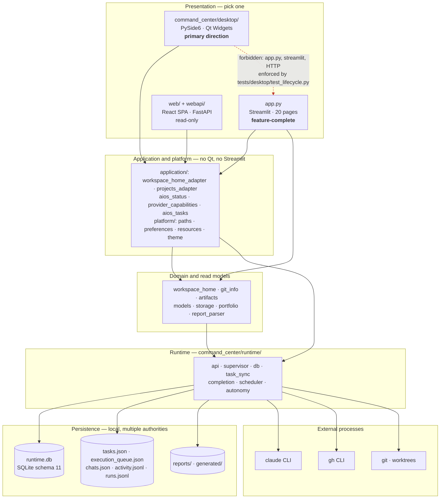

# AI Command Center

AI Command Center is a **native, local-first, single-user developer control plane**. It plans
engineering work, launches and observes AI-assisted engineering runs, coordinates Portfolio tasks,
and completes guarded GitHub delivery workflows — all in one process on one machine, with
fail-closed safety on every privileged action.

The committed product direction is **desktop-native, not browser-based**: the daily-use interface
is the PySide6/Qt Widgets client in [`command_center/desktop/`](command_center/desktop/), launched
with `python -m command_center.desktop`. It runs in a single local process and requires no browser,
no local HTTP server, and no Streamlit — importing the desktop startup path pulls in PySide6 and
nothing else, a contract enforced by [`tests/desktop/test_lifecycle.py`](tests/desktop/test_lifecycle.py).

The Streamlit application (`app.py`) remains the **feature-complete** interface and is not
deprecated. Native parity is being reached deliberately, increment by increment; until it is,
Streamlit is where you launch agents and drive the completion pipeline.

This repository is not a production, distributed, or remote-worker execution platform. Its durable
state is local to the machine running it, and there is no authentication layer in any interface.

## Which interface does what

| | Native desktop (`command_center.desktop`) | Streamlit (`app.py`) | Web dashboard (`web/`) |
|---|---|---|---|
| Status | Primary direction; 3 of 9 sections active | Feature-complete today | Read-only companion |
| Screens | Home (Workspace Home), Projects, Settings | 20 page handlers, 16 in the sidebar | Single Workspace Home page |
| Reads workspace, runs, reports, artifacts, activity | Yes | Yes | Yes |
| Launch agents, cancel runs, drive completion, Portfolio | **No** — out of scope for Increment 1 | Yes | No |
| Writes | Repository paths, theme/density, window geometry only | Full | None |
| Needs a browser or HTTP server | No | Yes | Yes |
| Runtime dependency | PySide6 | Streamlit | FastAPI + built SPA |

The six inactive desktop sections (Sessions, Execution, Git, Artifacts, Reports, Agents) are
rendered visibly disabled rather than hidden, so the sidebar never reflows between increments —
see [`command_center/desktop/sections.py`](command_center/desktop/sections.py), the single place
the sidebar, page stack, and tests agree on.

## Quick start — native desktop (PySide6)

Supported Python: **3.14**. Current application version: **2.0.0** (canonical value:
`command_center.__version__`).

```bash
# .venv-desktop is the project convention — scripts/build-desktop-macos.sh looks for it by name.
python3.14 -m venv .venv-desktop
./.venv-desktop/bin/python -m pip install -r requirements-desktop.txt

# Run FROM THE REPO ROOT — data paths resolve from the working directory.
./.venv-desktop/bin/python -m command_center.desktop
```

A healthy start is a native window titled "AI Command Center" with an empty log and no traceback.
`requirements-desktop.txt` is deliberately kept separate from `requirements.txt` (which stays
Streamlit-only); to run the desktop client and the test suite from one environment, install
`requirements-dev.txt` instead.

Entry point: [`command_center/desktop/__main__.py`](command_center/desktop/__main__.py) →
`app.run()`, which constructs the one `QApplication`, the settings store, the theme controller,
and the `AppShell` main window in that documented order.

Run the desktop test suite (offscreen, no visible window):

```bash
./.venv-desktop/bin/python -m pytest tests/desktop -q     # 175 passed as of 2026-08-07
```

**Gotchas:**

- `QT_QPA_PLATFORM` must be **unset** for a visible window. `tests/desktop/conftest.py` uses
  `os.environ.setdefault(..., "offscreen")`, so an inherited `offscreen` silently makes the GUI
  invisible and an empty string crashes Qt. Never export it manually.
- A missing PySide6 is a **false green**: `conftest.py` calls `pytest.importorskip("PySide6")` and
  skips the entire desktop suite. Check for a three-digit `passed` count, not merely the absence of
  red.
- `AICC_DATA_DIR` redirects runtime storage (default `./data`). Set it to keep a scratch run off
  real data.
- `AICC_DATA_DIR` / `AICC_GENERATED_ROOT` / `AICC_REPORTS_ROOT` are auto-configured **only inside a
  packaged bundle**: the `packaging/*/entrypoint.py` files call
  `command_center.platform.paths.configure_runtime_environment()` to point the app at a conventional
  live workspace (overridable with `AICC_WORKSPACE_ROOT`). Running `python -m` never does this, so a
  source run reads `./data` relative to the working directory.

### Packaged builds

PyInstaller specs and smoke checklists exist for both first-class targets — macOS Apple Silicon and
Windows 11 x64. Builds are **unsigned development bundles**, not distributable releases:

```bash
./.venv-desktop/bin/python -m pip install -r requirements-desktop-build.txt   # adds PyInstaller
./scripts/build-desktop-macos.sh        # → dist/macos/AI Command Center.app
./scripts/build-desktop-windows.ps1     # → Windows 11 x64 build
```

The macOS script requires an **arm64** interpreter and exits with status 2 otherwise; override the
interpreter with `DESKTOP_PYTHON=/path/to/python`. Because the bundle is unsigned, first open it via
right-click → Open. See [`docs/desktop/WINDOWS_RUNBOOK.md`](docs/desktop/WINDOWS_RUNBOOK.md) and the
per-platform `packaging/*/SMOKE_CHECKLIST.md`.

**Gate status:** `AICC-D1-GATE` is formally **Review**, not Done. macOS Apple Silicon passed on real
hardware; the interactive Windows 11 x64 leg has never been performed on a real machine, and a
`windows-latest` CI job covers only the automated half. See
[`docs/desktop/D1_FINAL_GATE_SMOKE_TEST.md`](docs/desktop/D1_FINAL_GATE_SMOKE_TEST.md).

## Architecture

Layers depend strictly downward. The desktop presentation layer may not import `app.py`, Streamlit,
or any HTTP client; it reaches data only through `command_center/application/` adapters, which own
the single `ExecutionCenterAPI` and return read-model output unchanged so every sensitivity
redaction is inherited verbatim.



Deeper treatments: [`ARCHITECTURE.md`](ARCHITECTURE.md) for the whole system,
[`docs/desktop/ARCHITECTURE.md`](docs/desktop/ARCHITECTURE.md) for the desktop package
architecture, dependency rules, threading model, and lifecycle.

The native Home page renders asynchronously through the D2B worker framework (`QThreadPool`), so the
GUI thread is never blocked by a snapshot fetch, and the page itself owns no business logic and
performs no redaction — it presents already-sanitized data.

## Quick start — Streamlit (full feature set)

```bash
python3.14 -m venv .venv
source .venv/bin/activate
pip install -r requirements.txt
pip install -r requirements-dev.txt

python -m streamlit run app.py     # or: scripts/start-ui.sh
```

`scripts/start-ui.sh` activates `.venv` when present, forwards additional Streamlit arguments, and
binds to localhost by default. It does not install dependencies. The application has no
authentication, so it must not be reachable from the local network unless you explicitly opt in:

```bash
scripts/start-ui.sh --server.address 0.0.0.0   # explicitly expose (not recommended)
```

The local Claude execution paths require an installed and authenticated `claude` CLI. Optional
environment variables are documented in [`.env.example`](.env.example); the application does not
load `.env` automatically.

Streamlit registers 20 page handlers: Dashboard, Workspace Home, Executive, Create Task, Project
Chat, Kanban, Волны (Waves), AI Agents, Live Execution Center, Run Journal, Timeline, Projects,
Generated Files, Reports, Context, Git Center, Workspace Launcher, Focus Mode, Portfolio Execution,
and Portfolio Overview. The sidebar shows 16 of them — Project Chat, Generated Files, Reports, and
Context open inside the project view instead of as standalone entries, though every handler stays
reachable by deep link and the command palette.

## Quick start — read-only web dashboard

```bash
pip install -r requirements-web.txt
scripts/start-web.sh          # → http://localhost:8791
```

`scripts/start-web.sh` installs `web/node_modules` if missing, builds the SPA into `web/dist`, and
serves it together with the read-only `/api/home` endpoint from one FastAPI process — no separate
dev server or CORS configuration in this mode. It has an EN/RU language toggle and a background
switcher. Like the other interfaces it binds to localhost only, has no authentication, and honors an
existing `AICC_DATA_DIR`.

## Capability status

| Classification | Capabilities |
|---|---|
| Implemented and enabled by default | Native desktop shell with a data-wired Workspace Home, Projects, and Settings; Streamlit UI; planning and Kanban; project context, reports, and generated-task views; JSON/JSONL project-chat and activity stores; asynchronous local Claude CLI execution; persisted run events; cancellation and timeouts; fail-closed task-workspace provisioning and verification; a persisted execution queue whose application-owned mutations are locked; Portfolio parsing, intelligence, and guarded worktree launch; completion-state seeding and read-only completion status |
| Implemented service/API foundations, not autonomously driven | Deterministic read-only scheduling decisions through `ExecutionCenterAPI.plan_schedule`; persisted, evidence-backed autonomy proposals surfaced in an operator approve/reject inbox (`ui/proposals_panel.py`). Neither has a background driver, durable scheduling claim/lease, or automatic dispatcher |
| Implemented but opt-in | Completion autopilot through `AICC_COMPLETION_AUTOPILOT`; AIOS tasks backend through `AICC_TASKS_BACKEND=aios`; OpenAI project-chat provider when its package and environment variables are supplied; project-specific completion policies permitting automatic merge or recovery |
| Implemented, unsigned, not release-grade | macOS and Windows PyInstaller desktop bundles |
| Legacy but still present | Synchronous Claude execution; `runs.jsonl` run journal; generated-task shell workflow |
| Designed or planned, not implemented | The six inactive desktop sections; agent launch and cancellation from the desktop client; code signing, notarization, and auto-update; distributed execution; durable remote workers; seamless attachment to a subprocess after the hosting Python process restarts |

Normal task launches require an explicit user action and confirmation. The scheduling API can return
advisory `ASSIGN`, `DEFER`, or `BLOCKED` decisions from a point-in-time snapshot, but it does not
persist a claim or launch anything. Periodic Streamlit fragments refresh views and recompute
readiness; no background task scheduler or automatic dispatcher is implemented.

## Repository layout

- [`command_center/desktop/`](command_center/desktop/) — the native PySide6 client: app assembly,
  main window, sidebar, top bar, theme and design tokens, i18n registry, async workers, reusable
  components, and the Home/Projects/Settings pages.
- [`command_center/application/`](command_center/application/) — the adapter layer between
  presentation and the runtime/read models. No Qt and no Streamlit import lives here.
- [`command_center/platform/`](command_center/platform/) — OS-facing abstractions: path resolution
  for source and packaged runs, native preferences, resources, theme detection, and file-manager
  integration.
- [`command_center/`](command_center/) — storage, models, read models, launch services, fail-closed
  workspace provisioning, execution-queue and Portfolio orchestration, runtime supervision,
  completion services, Git/GitHub adapters, and Streamlit UI components.
- [`command_center/runtime/`](command_center/runtime/) — the SQLite runtime API, Supervisor, process
  reconciliation, task projection, completion state machine, read-only scheduling planner, and
  autonomy proposal domain/service.
- [`command_center/ui/`](command_center/ui/) — extracted Streamlit panels and renderers. Much of the
  routing and presentation still remains concentrated in `app.py`.
- [`app.py`](app.py) — the direct Streamlit entry point.
- [`packaging/`](packaging/) — per-platform PyInstaller specs, entrypoints, and smoke checklists.
- [`scripts/start-task.sh`](scripts/start-task.sh) — the legacy generated-task launcher. It
  currently recognizes only `AIOS`, `BANK`, and `LEGAL`.
- [`tests/`](tests/) — unit, integration, concurrency, subprocess, Git/worktree, Portfolio,
  completion, Streamlit `AppTest`, and offscreen pytest-qt desktop coverage.

## Persistence and sources of truth

AI Command Center deliberately has more than one persistence authority:

| Store | Role |
|---|---|
| `data/tasks.json` | Planning and Kanban task store |
| `data/runtime.db` | Authoritative SQLite schema 11 state for runtime tasks, sessions, runs, run events, reports, completion, and autonomy proposals/evidence/events |
| `data/execution_queue.json`, `data/execution_queue.lock` | Separate persisted planning/execution queue plus its same-host cooperative OS advisory lock |
| `data/runs.jsonl` | Legacy append-only synchronous run journal |
| `data/chats.json`, `data/activity.jsonl` | Currently used project-chat and activity stores, separate from SQLite |
| `data/project_config.json` | Local project repository and completion-policy overrides |
| `data/portfolio_config.json` | Portfolio project-to-repository mapping |
| `data/portfolio_launches.json`, `data/portfolio_locks/` | Portfolio launch registry and coordination locks |
| `reports/<PROJECT>/` | Full Markdown execution and chat reports |
| `generated/<PROJECT>/` | Generated legacy task artifacts |

`data/tasks.json` remains the planning and Kanban task store. `data/runtime.db` is authoritative for
execution, completion, and the autonomy-proposal lifecycle. Schema 11 contains the application tables
`task`, `session`, `run`, `run_event`, and `report`; the three completion tables; and `proposal`,
`proposal_evidence`, and `proposal_event`; `schema_version` tracks migrations. It also holds a
`queue_entry` mirror table (ADR 0007 dual-write), but `execution_queue.json` stays the authoritative
queue, and there is no scheduler-claim table. The legacy `runs.jsonl` journal and the current
JSON/JSONL project-chat and activity stores coexist with SQLite, while `execution_queue.json` and
Portfolio registries, reports, and generated artifacts are additional persisted boundaries.
Reconciliation is therefore required: Execution Center refreshes project SQLite run/completion state
back to Kanban tasks, and queue readiness is recomputed from the planning store. These are
projections, not a single transactional database.

Most local artifacts are excluded by the checked-in [`.gitignore`](.gitignore), which also covers
`data/runtime.db` and its WAL/SHM sidecars. Tests redirect data through `AICC_DATA_DIR`.

### Runtime history retention

`data/runtime.db` grows with every run event. Retention is **off by default** and opt-in via
environment variables, so existing installs and the test suite are unaffected:

- `AICC_RUNTIME_RETENTION_DAYS=<N>` — on startup (after schema migration), delete `run_event` rows
  for runs terminal longer than `N` days. The terminal run row itself is kept (it stays visible in
  the Execution Center and to reconciliation); only the bulky per-output event history is pruned.
  Pruning uses fixed-size batches so database size does not determine transaction size. The
  maintenance archive path also streams rows into its compressed JSONL archive one batch at a time.
- `AICC_RUNTIME_VACUUM_ON_START=1` — run `VACUUM` after pruning to reclaim disk. VACUUM rewrites the
  database under an exclusive lock, so enable it only on a single-host install that can briefly pause
  other writers.

## Execution lifecycle

The primary launch path is asynchronous and, in Increment 1, reachable only from Streamlit:

1. The user selects a task or ad-hoc instruction, repository, task type, and timeout.
2. For a normal task launch, `prepare_task_launch` resolves the selected workspace, source
   repository, expected branch, and base branch, then classifies the request as ready, requiring
   warning acknowledgement, provisionable, or blocked.
3. The UI requires explicit confirmation before any branch/worktree provisioning or runtime mutation.
   Each warning renders its own acknowledgement keyed by a stable issue code; the launch stays
   blocked until every one is ticked.
4. The normal task-v2 path may provision a missing worktree offline with `git worktree add`, never
   falling back to the source repository, and must pass fail-closed `WorkspaceSpec` verification.
   Wrong repository ownership, detached or wrong branch, and a primary worktree used for feature work
   are hard failures; the selected status policy controls dirty/untracked checks.
5. A read-only preflight rejects an already-active task or workspace when observed. At run insertion,
   SQLite transactionally enforces exact-workspace exclusivity; task-id preflight is not a durable
   claim and can race with another launcher.
6. The API persists task, session, and run records in `data/runtime.db`.
7. On a POSIX host with `waitid(WNOWAIT)`, the Supervisor starts the Claude CLI with
   `Popen(shell=False, start_new_session=True)` and atomically records PID identity plus the
   `RUNNING` transition. Unsupported hosts fail closed before `Popen`.
8. Reader and watchdog threads handle output and timeout while process-group exit, durable terminal
   persistence, and report finalization remain separate milestones.
9. Cancellation and timeout serialize signal/exit/reap decisions against the captured launch-time
   PGID, drain descendants before reaping the leader, and escalate from termination to kill when
   needed. A post-exit cancellation is rejected rather than relabelling a completed run.
10. Run-to-task reconciliation updates the Kanban projection and seeds or advances completion state.

The Supervisor owns live `Popen` handles, pipes, and reader threads only inside the hosting Python
process. SQLite state survives restart, but stdout/stderr pipes and live process handles cannot be
restored. Startup reconciliation can inspect a persisted PID and its recorded identity to classify a
run; it cannot seamlessly resume supervision or reattach to the original child process.

The legacy synchronous `execute_agent_launch` and JSONL journal remain for compatibility and tests.
The Streamlit task-launch bridge uses the asynchronous runtime path. Low-level/ad-hoc `start_run`
calls may omit `WorkspaceSpec`; the fail-closed isolation guarantee above is scoped to the normal
task-v2 launch paths that supply it.

## Execution queue

`data/execution_queue.json` is a separate whole-file persisted queue. Queue entries track planning
status, dependencies, readiness, and launch linkage. Readiness is recalculated when queue and UI
checkpoints run. The queue never launches a task by itself: the user must click the launch control
and pass the normal confirmation and preflight boundaries.

Queue writes use atomic file replacement. Application-owned persisted read-modify-write cycles
(`enqueue_and_persist`, `dequeue_and_persist`, `reevaluate_and_persist`, and launch-result commit)
hold `data/execution_queue.lock` across the complete load-transform-save operation. This is a
same-host cooperative OS advisory lock, not a distributed lock. Raw `load_queue`/`save_queue` remain
available as uncoordinated primitives, and reads stay lock-free.

## Portfolio intelligence and execution

Portfolio integration reads task cards from a separate Portfolio checkout, including lane, project,
dependency, conflict, branch, worktree, launch-profile, and permission-profile metadata. The
Portfolio Overview computes read-only project health, dependency waves, cycles, critical paths,
readiness, capacity, and recommendations. These intelligence views are derived at read time; they do
not edit Portfolio cards.

Portfolio Execution:

1. parses and validates ready cards;
2. resolves the project to an explicitly configured local repository;
3. checks dependencies, conflicts, launch registry, branch, worktree, and collision constraints;
4. previews the launch plan;
5. after explicit user action, creates or attaches the task branch and Git worktree;
6. persists the Portfolio launch registry and uses the locked queue helpers for queue insertion or
   rollback;
7. launches through the same asynchronous Execution Center API.

Worktree creation and rollback are intentionally bounded. Existing worktrees are validated before
attachment, and rollback removes only resources created by the failed launch attempt. Portfolio batch
launch remains user-triggered and applies a concurrency cap; it is not autonomous scheduling.

## Completion pipeline

A terminal process result is not the same as a completed engineering task. The persisted completion
state machine can:

- resolve and run an allowlisted validation plan;
- verify branch and commit evidence;
- push a branch without force-push;
- discover or create a GitHub pull request through `gh`;
- wait for checks, reviews, or manual merge;
- optionally merge under project policy;
- recover a closed-unmerged pull request when explicitly enabled;
- verify that the result is reachable from the target branch before marking the task completed.

Completion state, attempts, validation results, and events are stored in `runtime.db`. Conservative
defaults require validation and a pull request, use manual merge, and disable recovery. The
completion autopilot is opt-in through `AICC_COMPLETION_AUTOPILOT` and disabled by default. When
enabled, it advances due completion records in a process-local background thread; it is not a general
task scheduler. The Streamlit completion panel only displays persisted status; it does not expose
manual advancement controls. Programmatic on-demand advancement is available through the runtime API.

## Git and GitHub safety boundaries

Read-only Git views and preflight checks do not mutate repositories. The native desktop client is
read-only except for repository-path configuration and interface preferences, so it crosses none of
these boundaries. Other narrowly scoped components do have write capabilities:

- Normal task-v2 workspace provisioning may run `git worktree add` only after explicit confirmation;
  the resulting path must pass source-repository, branch, isolation, and status verification before
  process launch.
- Portfolio orchestration may create a branch/worktree and may remove only resources it created while
  rolling back a failed pre-launch transaction.
- Completion Git operations may push or recreate a branch; force-push is rejected.
- The GitHub adapter may discover, create, and — only when completion policy permits — merge pull
  requests through fixed `gh` argument lists.
- Validation commands are parsed with `shell=False`, bounded by timeouts, and restricted to an
  executable allowlist. The allowlist scopes the *entry binary* (it blocks direct `sh`/`rm`/`curl`
  invocation); interpreter-class entries such as `python3`, `node`, `npx`, and `make` will run
  whatever code the operator-supplied arguments specify, so `validation_commands` is trusted operator
  configuration and must be reviewed like any other privileged setting.

Launches and warnings require explicit UI confirmation. Normal completion defaults preserve manual
merge. Commit, push, pull-request, and merge authority remains a privileged operational boundary;
enabling an opt-in policy or invoking a corresponding control must be treated as explicit
authorization. Launched implementation/remediation agents can edit files, but their Claude tool
configuration denies Git write commands. Review task types receive only read/search tools.

## Validation

The test suite redirects local data through `AICC_DATA_DIR` and uses temporary report paths. Tests
mock scenarios that would otherwise invoke the real Claude CLI, so validation does not launch real
agent jobs or write to the normal runtime stores.

The same validation gates run locally and automatically in CI:

```bash
git diff --check
ruff check .
python -m compileall -q command_center scripts tests app.py
pytest -q
```

`./scripts/preflight.sh` (or `make preflight`) runs the first three — the fast, deterministic part
of the CI Quality gates — in one command; run it before pushing.

For a faster local pytest loop, `pytest-xdist` is in the dev dependency group. A few
timing-sensitive subprocess tests (SIGTERM-grace escalation, process-tree teardown, concurrent
registry writers) miss their deadlines when 8 workers saturate the CPU, so they carry a `serial`
marker and run in a second, single-process phase:

```bash
pytest -q -n 8 -m "not serial" && pytest -q -m serial   # or: make test-fast
```

This is a local-only speedup; CI intentionally keeps its serial `pytest -q` run.

For an even faster inner loop while iterating on one change, `pytest-testmon` (also in the dev
dependency group) caches a coverage-derived test↔source dependency map and re-runs only the tests
whose covered code actually changed since the last run — at test-function granularity, not just
file granularity:

```bash
pytest -q --testmon          # first run seeds the cache (make test-impacted-seed)
pytest -q --testmon          # subsequent runs: only affected tests re-execute (make test-impacted)
```

Also local-only and complementary to (not a replacement for) `scripts/ci/test_impact/
select_tests.py`'s static-AST selector that drives CI's advisory `Impact fast pre-check` job:
testmon's map comes from real coverage data, so it also catches dynamic-import and runtime-only
dependencies the static walker can't see, at the cost of needing a seed run and going stale across
a large rebase (re-seed with `make test-impacted-seed` if selections look suspiciously narrow).
CI's required gate is unaffected either way — it always runs the full suite.

`.github/workflows/ci.yml` checks the committed diff for whitespace errors and runs Ruff, byte
compilation, and pytest for pull requests into `main`, pushes to `main`, and manual dispatches on
Python 3.14, plus a `windows-latest` job covering the automated half of the desktop leg. The workflow
uses a read-only token, pins actions to commit SHAs, and cancels superseded runs for the same ref. It
does not itself configure branch protection; repository settings must separately require the check if
merges are to be blocked on it.

## Current limitations and risks

- The native client covers three of nine sections and cannot launch, cancel, or complete work;
  Streamlit remains required for every privileged operation.
- `AICC-D1-GATE` is still **Review**: the interactive Windows 11 x64 acceptance pass has never been
  performed on real hardware.
- Desktop bundles are unsigned and un-notarized, with no auto-update path.
- Multiple persistence authorities require explicit reconciliation and cannot provide one atomic
  transaction across planning, runtime, queue, Portfolio, reports, and legacy journals.
- Legacy synchronous/JSONL and current asynchronous/SQLite execution paths coexist.
- Supervisor ownership is process-local; a restart loses pipes and live `Popen` handles.
- `app.py` and several runtime/Portfolio service modules are large, concentrated change surfaces.
- A static type checker is configured (permissive, non-strict) via `pyproject.toml` and surfaced as a
  non-blocking CI step; it is not yet a merge gate and the codebase is not fully typed.
- The checked-in CI workflow does not itself enforce branch protection. Enable "Require status checks
  to pass before merging" on `main` with the `Quality gates` check to make it a real gate.
- The execution-queue lock is same-host and cooperative; raw queue mutation primitives can bypass it,
  and there is no distributed coordination.
- Scheduler decisions are point-in-time advice, not persisted claims. Task-id, capacity, and
  within-plan workspace decisions can change before the separate explicit launch; only exact
  workspace exclusion is enforced transactionally by the runtime launch path.
- The autonomy proposal layer has an operator approve/reject inbox but no automated evidence
  collectors, per-project policy resolver, background driver, or executor; dispatch records and
  returns a plan but does not perform it.
- Fail-closed workspace verification is scoped to normal task-v2 paths that supply a `WorkspaceSpec`;
  low-level/ad-hoc launches preserve their separate behavior.
- Streamlit and the web dashboard bind to localhost by default; passing an explicit
  `--server.address` overrides that. No interface has authentication, so do not bind to a reachable
  interface.
- The system does not provide distributed execution, remote-worker durability, or seamless process
  resumption.

## Further documentation

- [Desktop documentation set](docs/desktop/README.md) — vision, architecture, information
  architecture, design system, platform behavior, and the frozen D1–D4 scope
- [System architecture](ARCHITECTURE.md)
- [Master product roadmap (H1)](docs/roadmap/MASTER_PRODUCT_ROADMAP.md)
- [Current operating state](CURRENT_STATE.md)
- [Completion pipeline operator guide](docs/completion-pipeline.md)
- [Accepted architecture decisions](docs/adr/)
- [Changelog](CHANGELOG.md)
</content>
</invoke>
