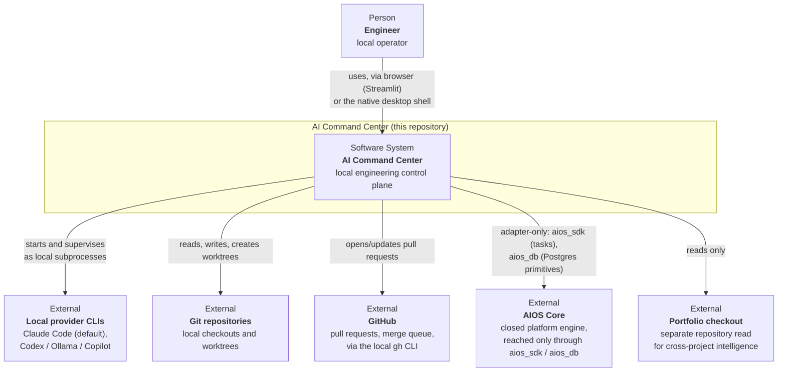
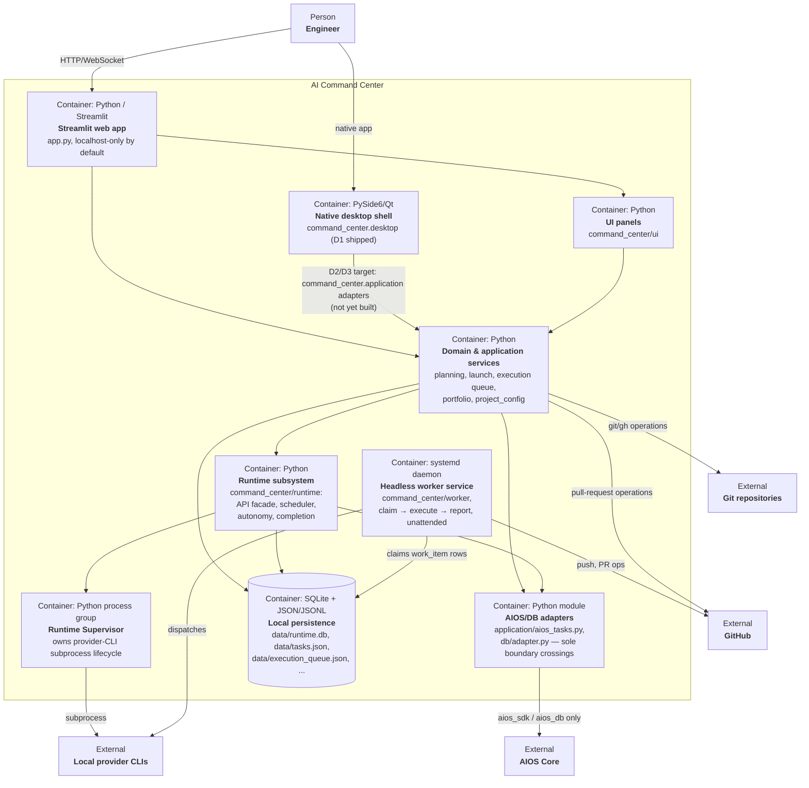

<!-- GENERATED FILE — do not hand-edit.
     Source: the `.mmd` files in this directory.
     Regenerate with `python scripts/generate_architecture_docs.py`.
     Checked for staleness by tests/architecture/test_architecture_docs_freshness.py. -->

# AI Command Center — architecture as code

C4-style Mermaid diagrams for AI Command Center, checked in as text so they render
natively on GitHub and stay reviewable in a normal diff. These are diagrams, not
authority: [`ARCHITECTURE.md`](../../ARCHITECTURE.md) and the accepted
[ADRs](../adr/) are authoritative if a diagram and the prose ever disagree — update
the `.mmd` source and regenerate rather than editing this file.

## 1. System context (C4 level 1)

Who and what AI Command Center talks to, from the outside. The system boundary is the repository this document lives in; everything else is an external person or system it integrates with.



Source: [`context.mmd`](context.mmd)

## 2. Containers (C4 level 2)

The deployable/runnable units inside the AI Command Center boundary, and how they reach the external systems from the context diagram. See [`ARCHITECTURE.md`](../../ARCHITECTURE.md) for the prose description these containers implement.



Source: [`container.mmd`](container.mmd)

## Keeping this in sync

Each diagram above is generated from the `.mmd` file of the same name in this
directory — edit that file, not this one. After editing, run:

```sh
python scripts/generate_architecture_docs.py
```

`tests/architecture/test_architecture_docs_freshness.py` (part of the repository's
existing architecture-fitness suite) fails if this file is stale relative to the
`.mmd` sources, so a diagram change without regeneration does not merge silently.

An ADR that changes AI Command Center's external integrations or its container
boundaries should update these diagrams — see
[`docs/adr/TEMPLATE.md`](../adr/TEMPLATE.md).
